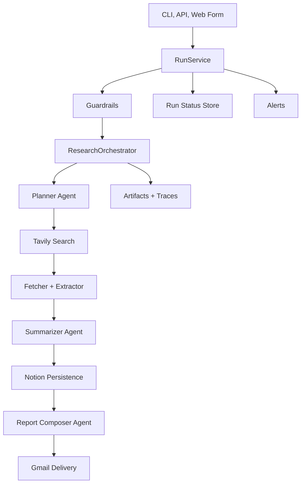

# AI Autonomous Research Agent

AI Autonomous Research Agent is an agentic research engine that turns one query into a sourced report, stores findings, and delivers the output by email.

Project package name remains autonomous-research-agent for compatibility.

## What This System Does

Input:

- Research query
- Recipient email
- Depth (quick, standard, deep)

Output:

- Structured findings from web sources
- Citation-grounded report (markdown + HTML)
- Optional Notion persistence of findings
- Email delivery via Gmail
- Full run artifacts and status traces

## Product Architecture



## Run Walkthrough

What one run does in plain terms:

1. You submit a query and recipient email from CLI, API, or web form.
2. Guardrails check request size, runtime caps, and token budget limits.
3. Planner agent converts your query into focused subtopics and search queries.
4. Tavily search wrapper fetches candidate URLs and ranks them.
5. Fetcher downloads pages, extractor cleans HTML into normalized text chunks.
6. Summarizer agent turns source chunks into scored findings.
7. Notion wrapper attempts to persist findings with idempotency keys.
8. Report agent produces concise synthesis used for final markdown/HTML report.
9. Gmail wrapper sends the report to the recipient.
10. Artifacts, status, and trace events are persisted for debugging and replay.

## Agentic Design

This codebase uses stage-specialized LLM agents, not one monolithic prompt:

- Planner agent:
  - Input: user query, depth, constraints
  - Output: subtopics, search queries, estimated source count, rationale
  - Purpose: keeps research breadth/depth bounded and cost-aware
- Summarizer agent:
  - Input: extracted source chunks + original query
  - Output: summary, tags, relevance score, confidence, key points
  - Purpose: convert noisy web content into comparable finding objects
- Report composer agent:
  - Input: ranked findings
  - Output: TLDR and executive summary used by report renderer
  - Purpose: produce decision-friendly synthesis while citation mapping stays deterministic in code

All agent calls go through a provider abstraction in app/providers/llm so model vendors can be swapped with minimal orchestration changes.

Reliability details:

- Planner and report stages include fallback behavior so malformed or slow model responses do not always fail the entire run.
- Guardrails enforce hard limits before expensive stages start.
- RunService applies global timeout handling and marks run lifecycle states (`accepted`, `running`, `completed`, `failed`).

## MCP and External Integrations

Provider wrappers in app/providers/mcp:

- Tavily wrapper (`tavily_search.py`):
  - Sends planned search queries to Tavily.
  - Normalizes result shape for internal ranking/dedupe pipeline.
  - Works as the discovery layer for downstream fetch/extract.
- Notion wrapper (`notion.py`):
  - Queries by `SourceKey` to avoid duplicate writes.
  - Creates pages in a target database with structured properties.
  - Failed writes are captured in dead-letter artifacts for replay.
- Gmail wrapper (`gmail.py`):
  - Sends HTML + text email payloads with delivery keys.
  - Supports retry behavior and delivery status tracking.
- Slack wrapper (`slack.py`):
  - Optional alert channel for repeated failures and delivery failures.

Why Agentic & MCP?:

- Agents handle reasoning and synthesis.
- MCP wrappers handle deterministic system actions (search, store, deliver).
- Orchestrator coordinates both sides so each layer has a single responsibility.

## Technology Stack

- Python 3.11+
- FastAPI for API routes
- Pydantic + pydantic-settings for schema and config validation
- OpenAI SDK for LLM tasks (OpenAI-first, Anthropic stub present)
- httpx + tenacity for resilient HTTP and retry logic
- BeautifulSoup4 for HTML parsing/extraction
- pytest + pytest-asyncio for tests

## Repository Structure

```text
app/
	api/                FastAPI endpoints and web form
	cli/                Command-line entrypoint
	core/               Run lifecycle, guardrails, tracing, alerts
	modules/
		planner/          Query decomposition and bounded plan generation
		search/           URL aggregation, dedupe, ranking
		fetcher/          Async fetch and content extraction
		summarizer/       Finding generation and filtering
		notion/           Persistence workflow and dead-letter behavior
		reporting/        Citation index + report rendering
		delivery/         Gmail delivery orchestration
	providers/
		llm/              LLM abstraction and OpenAI implementation
		mcp/              Tavily, Notion, Gmail, Slack wrappers
	schemas/            Request/response and domain models
	utils/              Artifact persistence and logging helpers
docs/
	p0..p10/            Phase design and implementation docs
tests/                Unit and integration-style tests
run_artifacts/        Per-run JSON artifacts
logs/                 JSONL traces and alert streams
```

## Setup and Run

### Prerequisites

- Python 3.11 or newer
- Valid API credentials for required integrations

### 1) Clone and install

Windows PowerShell:

```powershell
python -m venv .venv
.\.venv\Scripts\Activate.ps1
python -m pip install -e .[dev]
Copy-Item .env.example .env
```

macOS/Linux bash:

```bash
python3 -m venv .venv
source .venv/bin/activate
python -m pip install -e .[dev]
cp .env.example .env
```

### 2) Configure environment

Required secrets in .env:

- OPENAI_API_KEY
- TAVILY_API_KEY
- NOTION_TOKEN
- NOTION_DATABASE_ID
- GMAIL_CLIENT_ID
- GMAIL_CLIENT_SECRET
- GMAIL_REFRESH_TOKEN
- GMAIL_SENDER_EMAIL

Optional:

- SLACK_WEBHOOK_URL
- SENTRY_DSN

### 3) Start API server

```bash
python -m app.main
```

Server base: http://127.0.0.1:8000

### 4) Start a run from CLI

```bash
python -m app.cli --query "State of enterprise RAG adoption" --email "analyst@company.com" --depth standard
```

### 5) Start a run from web form

Open:

- http://127.0.0.1:8000/v1/research/form

## API Endpoints

- GET /v1/health
- POST /v1/research
- GET /v1/research/runs/{run_id}
- GET /v1/research/form
- POST /v1/research/plan
- POST /v1/research/candidates
- POST /v1/research/findings
- POST /v1/research/persist-findings
- POST /v1/research/report
- POST /v1/research/deliver

## Mermaid Diagram Visibility

Mermaid blocks in this README are rendered in platforms that support Mermaid markdown (for example GitHub and modern VS Code markdown preview). In plain text viewers, you will see the raw diagram source block.

## Runtime Controls and Observability

Guardrails:

- request size limits
- max source/query caps
- per-run LLM token budget cap
- global run timeout enforcement

Artifacts and logs:

- run_artifacts/<run_id>/research_plan.json
- run_artifacts/<run_id>/candidate_urls.json
- run_artifacts/<run_id>/documents.json
- run_artifacts/<run_id>/findings.json
- run_artifacts/<run_id>/report.json
- run_artifacts/<run_id>/delivery.json
- run_artifacts/<run_id>/run_trace.json
- run_artifacts/run_status/<run_id>.json
- logs/run_traces.jsonl
- logs/alerts.jsonl

## Notion Database Requirements

Database properties must exist with exact names and types:

- Title: title
- Summary: rich_text
- URL: url
- Relevance: number
- Confidence: number
- Tags: multi_select
- Query: rich_text
- RunID: rich_text
- SourceKey: rich_text
- Timestamp: date

Important: NOTION_DATABASE_ID must be a database ID, not a page ID.

## Testing and Quality

Run full test suite:

```bash
python -m pytest -q
```

Current implementation includes phases P0 through P10 with test coverage across planner, search, fetch/extract, summarization, persistence, reporting, delivery, run lifecycle, and tracing/alerts.


## Next Steps
- Format Gmail structure and make it look nicer
- Update the flow to conduct more research for deep and standard types
- Add a clean frontend UI
- Deploy to cloud
