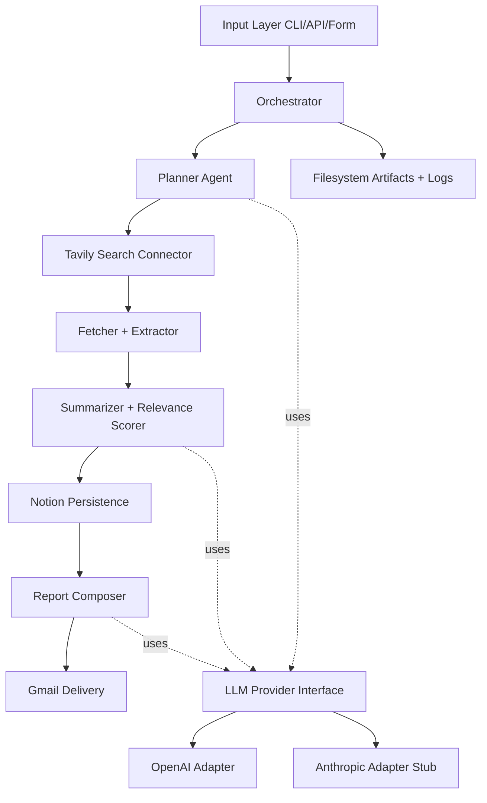

# P0-S3 Architecture Diagram and Interface Spec

## High-Level Architecture



## Module Interface Contracts

### Input Layer -> Orchestrator

```python
ResearchRunRequest(
    query: str,
    requester_email: str,
    depth: Literal["quick", "standard", "deep"] = "standard",
    max_sources: int | None = None,
    max_queries_per_plan: int | None = None,
    llm_token_budget_per_run: int | None = None,
)
```

### Planner

Input:

- query
- depth
- runtime constraints

Output:

```python
ResearchPlan(
    subtopics: list[str],
    search_queries: list[str],
    depth_strategy: str,
    estimated_source_count: int,
    rationale: str,
)
```

### Search Connector

Input: search queries with per-query limits.

Output: `SearchCandidate(url, title, snippet, query, rank)` list.

### Fetcher + Extractor

Input: candidate URLs.

Output: normalized document list with title/content/metadata.

### Summarizer + Scorer

Input: normalized docs + original query.

Output: finding records with summary, tags, relevance score, and confidence.

### Persistence

Input: findings + run metadata.

Output: write receipts and failed-write dead letters.

### Reporting

Input: findings + run metadata.

Output: report markdown/html + references index.

### Delivery

Input: recipient + report HTML/markdown.

Output: delivery status and message id.

## Idempotency Keys

- Notion write key: `run_id + url_hash`
- Email key: `run_id + recipient`

## Runtime Controls

- `max_sources`
- `max_queries_per_plan`
- `per_url_timeout_seconds`
- `global_run_timeout_minutes`
- `llm_token_budget_per_run`
