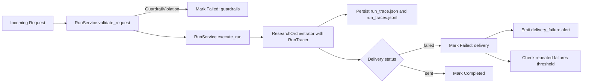

# P10 Guardrails, Observability, and Cost Governance

## Scope

This phase adds runtime safety and diagnostics to the unified execution path used by API and CLI flows.

Delivered capabilities:

1. Request guardrails with hard caps.
2. Structured stage tracing with persisted metrics.
3. Failure alert hooks for delivery errors and repeated run failures.

## Runtime Guardrails

Guardrails are enforced in `app/core/guardrails.py` and applied in `app/core/run_service.py` before pipeline execution starts.

Hard limits:

- `request_max_chars`
- `hard_max_sources`
- `hard_max_queries_per_plan`
- `hard_llm_token_budget_per_run`
- `global_run_timeout_minutes` (applied as full run timeout)

If a request violates guardrails, the run is marked failed with stage `guardrails` and execution is not attempted.

## Structured Tracing

`RunTracer` records stage-level events and metrics for each run.

Artifact outputs:

- `run_artifacts/<run_id>/run_trace.json`
- `logs/run_traces.jsonl`

Each trace includes:

- stage name
- start and end timestamps
- stage duration in ms
- stage status (`completed` or `failed`)
- optional stage metadata
- run metrics (for example result counts and estimated LLM token usage)

## Alert Hooks

`AlertService` writes alerts to `logs/alerts.jsonl` and can optionally emit to Slack when `SLACK_WEBHOOK_URL` is configured.

Alert conditions:

- Delivery failure (`delivery.status == failed`)
- Repeated failures within a time window

Config knobs:

- `ALERT_FAILURE_THRESHOLD`
- `ALERT_WINDOW_MINUTES`

## Runtime Flow (P10)

## Notes

- Run IDs are propagated from acceptance to orchestration so status records, artifacts, and traces stay aligned.
- Token governance is approximated at summarization/reporting stages using text-length estimation and budget-aware document throttling.
