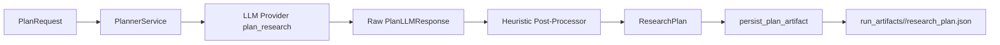

# P3 Planner Agent Design

## Scope

This phase delivers:

1. Strict planner prompt and output schema.
2. Planning heuristics and caps to bound breadth/depth.
3. Plan artifact persistence for auditability.

## Planner Flow Diagram



## Planner Output Schema

The planner returns JSON with the following fields:

- subtopics: list of focused subtopics
- search_queries: list of non-duplicate search queries
- depth_strategy: short strategy description
- estimated_source_count: bounded integer count of target sources
- rationale: concise explanation of planning choices

## Runtime Heuristics

The planner service enforces post-generation controls:

- Normalize whitespace and strip invalid entries.
- Deduplicate subtopics and queries case-insensitively.
- Clamp query volume by both depth and runtime constraints.
- Clamp estimated source count to configured caps.
- Apply fallback subtopics/queries when model output is weak.

Depth defaults:

- quick: up to 3 queries, min 6 sources
- standard: up to 6 queries, min 10 sources
- deep: up to 8 queries, min 12 sources

## Artifact Contract

Path pattern:

- run_artifacts/<run_id>/research_plan.json

Payload shape:

```json
{
  "run_id": "uuid",
  "created_at": "ISO-8601",
  "request": { "...": "..." },
  "constraints": { "...": "..." },
  "plan": {
    "subtopics": ["..."],
    "search_queries": ["..."],
    "depth_strategy": "...",
    "estimated_source_count": 10,
    "rationale": "..."
  }
}
```
