# P4 Search and URL Collection

## Scope

This phase implements:

1. Tavily search wrapper with retries/timeouts.
2. URL aggregation and normalization/deduplication.
3. Ranking and trimming with relevance plus source diversity.

## Flow

```mermaid
flowchart LR
    A[Research Plan search_queries] --> B[SearchService]
    B --> C[TavilySearchClient]
    C --> D[Raw Web Results]
    D --> E[URL Normalization]
    E --> F[Deduplication]
    F --> G[Relevance Scoring]
    G --> H[Diversity-Aware Ranking]
    H --> I[CandidateCollection]
    I --> J[run_artifacts/<run_id>/candidate_urls.json]
```

## Normalization Rules

- Keep only `http` and `https` URLs.
- Remove URL fragments.
- Remove known tracking params (`utm_*`, `gclid`, `fbclid`, etc.).
- Normalize default ports and trailing slash behavior.

## Ranking Heuristic

Each candidate receives a base relevance score from:

- token overlap between original query and title/snippet
- overlap between original query and source query
- query result position

Then a diversity bonus favors domains not yet selected.

## Artifacts

- `research_plan.json` (from P3)
- `candidate_urls.json` (added in P4)
