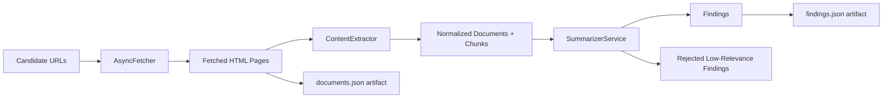

# P5 Fetch, Extract, and Summarize

## Scope

This phase implements:

1. Async URL fetching with retry, timeout, redirect handling, and user-agent controls.
2. HTML extraction to normalized text documents.
3. Chunked source summarization and relevance scoring.
4. Filtering low-relevance findings while retaining confidence metadata.

## Flow

## Extraction Rules

- Remove boilerplate tags: script, style, nav, header, footer, aside, form, iframe.
- Prefer article/main content regions when available.
- Normalize whitespace and reject thin pages below a character threshold.
- Split text into overlapping chunks to keep prompts bounded.

## Summarization Rules

- Summarize each chunk with 3-sentence guidance via LLM provider interface.
- Aggregate chunk results into document-level finding records.
- Compute average relevance and confidence across chunk summaries.
- Filter findings below configured minimum relevance threshold.

## API

- POST /v1/research/findings
  - Executes plan + search + fetch + extraction + summarization pipeline.
  - Returns findings and run artifact paths.
