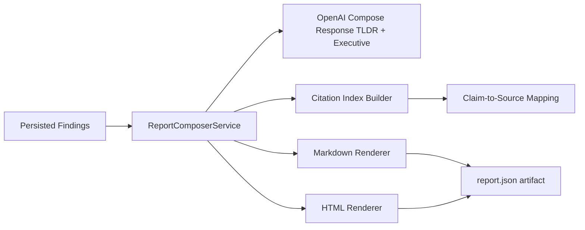

# P7 Report Composer and Citation Engine

## Scope

This phase delivers:

1. Report composition template with required sections.
2. Citation mapping from claim blocks to source URLs.
3. Markdown and HTML report rendering plus report artifact persistence.

## Report Structure

Generated report sections:

- TL;DR
- Executive Summary
- Key Findings
- Deep Dives (top 3)
- References

## Citation Engine

- Build a unique citation index from finding URLs.
- Assign stable reference numbers in ranked finding order.
- Attach citation markers to key finding and deep-dive claim blocks.
- Emit structured `claim_citations` with claim text and backing URL(s).

## Flow

## API

- POST /v1/research/report
  - Executes P3-P7 path.
  - Returns persisted findings metadata plus report markdown/html and citation index.
