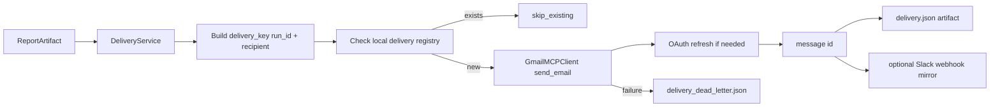

# P8 Gmail Delivery

## Scope

This phase adds:

1. Gmail delivery service for final report dispatch.
2. OAuth refresh-token flow for access token renewal.
3. Retry handling for transient Gmail API failures.
4. Idempotent send behavior keyed by run_id + recipient.
5. Delivery artifacts and dead-letter logging.
6. Optional Slack mirror via webhook.

## Flow

## API

- POST /v1/research/deliver
  - Executes P3-P8 path and returns delivery status + message id.
